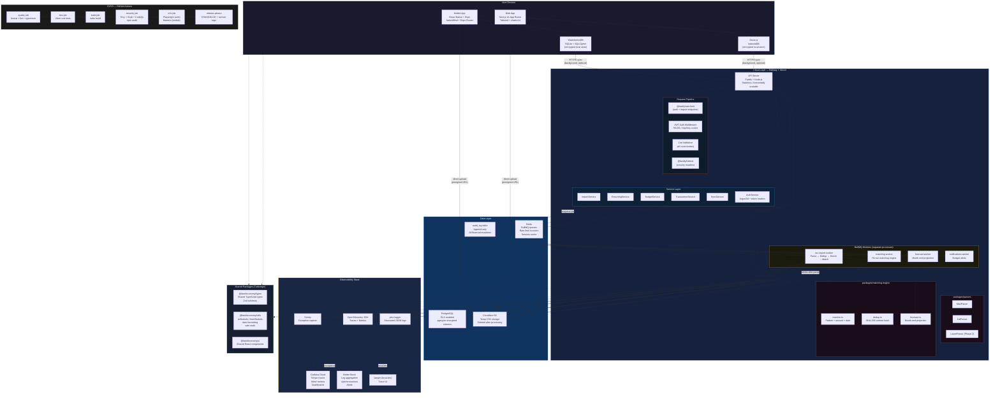

# System Architecture Diagram

```mermaid
graph TB
    subgraph DEVICES["User Devices"]
        MOB["Mobile App\nReact Native + Expo\nNativeWind + Expo Router"]
        WEB["Web App\nNext.js 14 App Router\nTailwind + shadcn/ui"]

        MOB_DB["WatermelonDB\nSQLite + SQLCipher\n(encrypted local store)"]
        WEB_DB["Dexie.js\nIndexedDB\n(encrypted local store)"]

        MOB --- MOB_DB
        WEB --- WEB_DB
    end

    subgraph CLOUD["Cloud Layer — Railway + Vercel"]
        API["API Server\nFastify + Node.js\nStateless / horizontally scalable"]

        subgraph MIDDLEWARE["Request Pipeline"]
            RL["@fastify/rate-limit\n(auth + import endpoints)"]
            AUTH["JWT Auth Middleware\nRS256 / httpOnly cookie"]
            ZOD["Zod Validation\n(all route bodies)"]
            HELMET["@fastify/helmet\n(security headers)"]
        end

        subgraph SERVICES["Service Layer"]
            TX_SVC["TransactionService"]
            REC_SVC["RecurringService"]
            BUDGET_SVC["BudgetService"]
            IMPORT_SVC["ImportService"]
            SYNC_SVC["SyncService"]
            AUTH_SVC["AuthService\nArgon2id + token rotation"]
        end

        subgraph WORKERS["BullMQ Workers (separate processes)"]
            W_CSV["csv-import worker\nParse → Dedup → Enrich → Match"]
            W_MATCH["matching worker\nRe-run matching engine"]
            W_FORECAST["forecast worker\nMonth-end projection"]
            W_NOTIFY["notifications worker\nBudget alerts"]
        end

        subgraph PARSERS["packages/parsers"]
            P_MAX["MaxParser"]
            P_CAL["CalParser"]
            P_LEUMI["LeumiParser (Phase 2)"]
        end

        subgraph MATCH_ENGINE["packages/matching-engine"]
            MATCHER["matcher.ts\nPattern + amount + date"]
            DEDUP["dedup.ts\nSHA-256 content hash"]
            FORECAST["forecast.ts\nMonth-end projection"]
        end
    end

    subgraph DATA["Data Layer"]
        PG["PostgreSQL\nRLS enabled\npgcrypto encrypted columns"]
        REDIS["Redis\nBullMQ queues\nRate limit counters\nSession cache"]
        R2["Cloudflare R2\nTemp CSV storage\nDeleted after processing"]
        AUDIT["audit_log table\nAppend-only\nAll financial mutations"]
    end

    subgraph OBSERVABILITY["Observability Stack"]
        PINO["pino logger\nStructured JSON logs"]
        OTEL["OpenTelemetry SDK\nTraces + Metrics"]
        SENTRY["Sentry\nException capture"]
        GRAFANA["Grafana Cloud\nTempo traces\nMimir metrics\nDashboards"]
        BETTERSTACK["Better Stack\nLog aggregation\nUptime monitors\nAlerts"]
        JAEGER["Jaeger (local dev)\nTrace UI"]
    end

    subgraph SHARED["Shared Packages (Turborepo)"]
        TYPES["@famileconomy/types\nShared TypeScript types\nZod schemas"]
        UTILS["@famileconomy/utils\ntoShekels / fromShekels\ndate formatting\nsafe math"]
        UI["@famileconomy/ui\nShared React components"]
    end

    subgraph CI["CI/CD — GitHub Actions"]
        CI_QUALITY["quality job\nformat + lint + typecheck"]
        CI_TEST["test job\nVitest unit tests"]
        CI_BUILD["build job\nturbo build"]
        CI_SECURITY["security job\nTrivy + Snyk + CodeQL\nnpm audit"]
        CI_E2E["e2e job\nPlaywright (web)\nMaestro (mobile)"]
        RELEASE["release-please\nCHANGELOG + semver tags"]
    end

    %% Device → Cloud connections (sync only — local-first)
    MOB_DB <-->|"HTTPS sync\n(background, optional)"| API
    WEB_DB <-->|"HTTPS sync\n(background, optional)"| API

    %% File upload bypasses API (presigned URL)
    MOB -->|"direct upload\n(presigned URL)"| R2
    WEB -->|"direct upload\n(presigned URL)"| R2

    %% API request pipeline
    API --> MIDDLEWARE
    MIDDLEWARE --> SERVICES

    %% Services → Data
    SERVICES --> PG
    SERVICES --> REDIS
    SERVICES --> AUDIT

    %% Import flow
    IMPORT_SVC -->|"enqueue job"| REDIS
    REDIS --> W_CSV
    W_CSV --> R2
    W_CSV --> PARSERS
    W_CSV --> MATCH_ENGINE
    W_CSV --> PG
    W_CSV -->|"delete after parse"| R2

    %% Other workers
    REDIS --> W_MATCH
    REDIS --> W_FORECAST
    REDIS --> W_NOTIFY
    W_MATCH --> MATCH_ENGINE
    W_FORECAST --> FORECAST

    %% Auth service
    AUTH_SVC --> PG

    %% Observability wiring
    API --> PINO
    API --> OTEL
    API --> SENTRY
    W_CSV --> OTEL
    W_CSV --> PINO
    PINO --> BETTERSTACK
    OTEL --> GRAFANA
    OTEL -.->|"local dev"| JAEGER
    SENTRY -.->|"exceptions"| GRAFANA

    %% Shared packages used by all
    MOB -.-> SHARED
    WEB -.-> SHARED
    API -.-> SHARED
    WORKERS -.-> SHARED

    %% CI
    CI_QUALITY --> CI_TEST --> CI_BUILD --> CI_SECURITY --> CI_E2E
    CI_E2E --> RELEASE

    style DEVICES fill:#1a1a2e,stroke:#4a9eff,color:#fff
    style CLOUD fill:#16213e,stroke:#4a9eff,color:#fff
    style DATA fill:#0f3460,stroke:#4a9eff,color:#fff
    style OBSERVABILITY fill:#1a2744,stroke:#f0a500,color:#fff
    style SHARED fill:#162032,stroke:#50c878,color:#fff
    style CI fill:#1a1a1a,stroke:#888,color:#fff
    style MIDDLEWARE fill:#0d1b2a,stroke:#e74c3c,color:#fff
    style SERVICES fill:#0d2137,stroke:#3498db,color:#fff
    style WORKERS fill:#1a1a0d,stroke:#f39c12,color:#fff
    style PARSERS fill:#1a0d1a,stroke:#9b59b6,color:#fff
    style MATCH_ENGINE fill:#1a0d1a,stroke:#9b59b6,color:#fff
```
